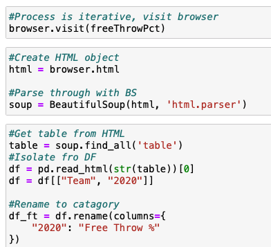
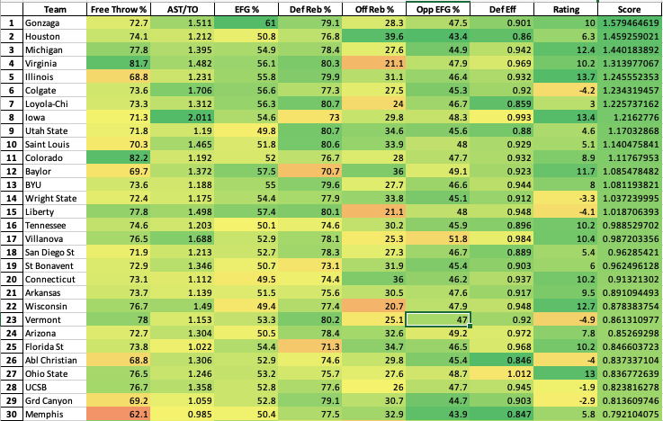

# March Madness

In 2019, a friend and I started what we called an “algorithm.” Every year when filling out our march madness brackets we would look at some key indicators that we believed to be important to win in a one game elimination tournament. The statistics that we looked at were Free Throw %, Assist/TO, Three Point %, Defensive Rebound %, Offensive Rebound %, Opponent Three Point % and Defensive efficiency. I wanted to make an easy way to evaluate teams on all of these metrics, and with that we created what we called FATDOOD. 

FATDOOD is simply the z score for for all those statistics, added up, and then divided by 7 (the length of statistics). Overly simple? Yes. Does it work? Also yes. 

In 2019, the algorithm spit out the Virginia Cavaliers as the best team in the sport. As the tournament played out, The Virginia Cavliers won march madness, and with that, the algorithm won a bracket pool with over 100 entries. 

At the beginning, I would parse through all the data by hand and input each and every stat for every team. Insanely laborious, there had to be a better way. Now with the skills I’ve learned I am able to scrape those stats for every team, transform it into a data frame through merges, and use simple python to get the Z-score for each value. I have now crated a script, which scrape the data, puts it into a data frame and orders it by score all within 30 seconds. A task that used to take hours on end, I can now update daily to track changes amongst the teams.

While there was no tournament to test the algorithm out in 2020, FATDOOD has its eyes set on the 2021 tournament. Below are the top 30 teams for the 2021 championship. Fatdood predicts a Gonzaga/Houston final with Gonzaga winning their first title in school history. 

